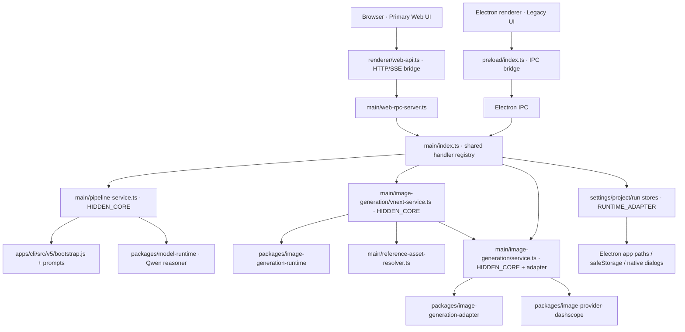
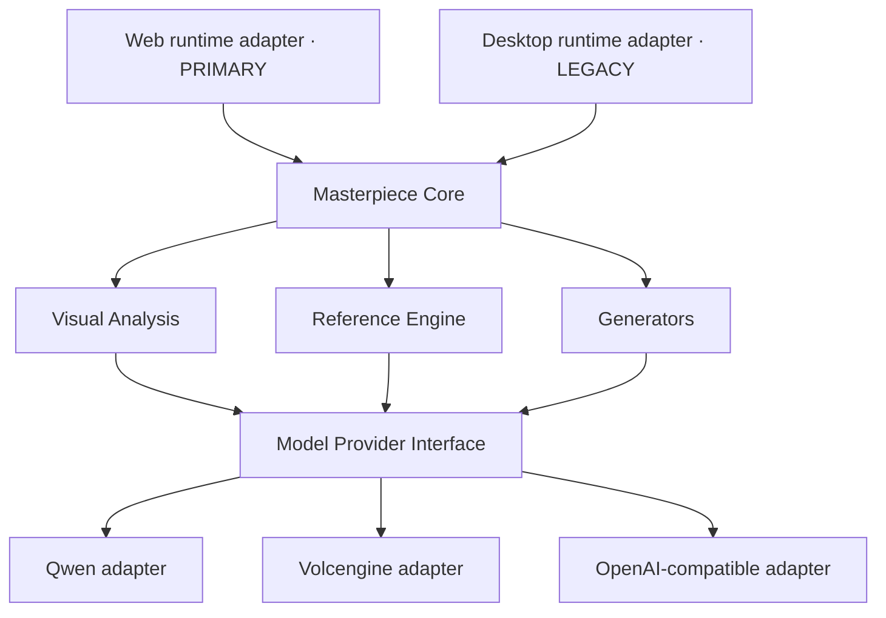

# Runtime Dependency Map

## Current architecture



The main finding is structural: Web does not import Desktop through a conventional package dependency, but its live backend is the Desktop main process. This is a runtime `Web → Desktop` dependency and is classified `ARCHITECTURE_VIOLATION` for future extraction work.

## Web runtime detail

```text
WEB (PRIMARY)
├─ UI
│  ├─ apps/desktop/src/renderer/src/main.tsx
│  ├─ apps/desktop/src/renderer/src/App.tsx
│  └─ components/*
├─ Transport
│  └─ renderer/src/web-api.ts
├─ API host (currently Desktop-owned)
│  ├─ main/web-rpc-server.ts
│  └─ main/index.ts handler registry
└─ Runtime dependencies
   ├─ Desktop main services
   ├─ Electron safeStorage/app/dialog/shell
   ├─ apps/cli v5 bootstrap and prompts
   └─ packages/* shared runtimes
```

## Desktop runtime detail

```text
DESKTOP (LEGACY)
├─ UI: same React tree as Web
├─ Native bridge: preload/index.ts
├─ Native integration
│  ├─ BrowserWindow
│  ├─ dialog / shell
│  ├─ app paths
│  └─ safeStorage
└─ Main service graph: same graph consumed by Web RPC
```

## Shared/core capability ownership today

| Capability | Current implementation | Ownership assessment |
|---|---|---|
| Analysis pipeline | `apps/desktop/src/main/pipeline-service.ts` + `apps/cli/src/v5` | HIDDEN_CORE spanning Desktop and CLI |
| Analysis provider client | `packages/model-runtime/src/qwen-reasoner.js` | Shared package, Qwen-named adapter |
| Project/analysis schemas | `apps/desktop/src/main/model-schema/*`, `packages/*contracts` | Mixed HIDDEN_CORE/shared package |
| Reference First | `apps/desktop/src/main/reference-first/*`, `image-generation/vnext-service.ts`, runtime package | Mixed HIDDEN_CORE/shared package |
| Prompt compiler | `packages/image-generation-runtime/src/vnext`, space compiler | Shared package / BEHAVIOR_SENSITIVE |
| Space target authority | `packages/image-generation-runtime/src/space/*` | Shared package / BEHAVIOR_SENSITIVE |
| Generator orchestration | `apps/desktop/src/main/image-generation/service.ts` | HIDDEN_CORE with filesystem adapter concerns |
| Provider adapters | `packages/image-generation-adapter`, `packages/image-provider-dashscope` | Shared packages |
| Credential/config | `apps/desktop/src/main/settings-store.ts` | Electron runtime adapter |
| Assets/runs | Desktop project/run stores and filesystem loaders | Runtime adapter mixed with orchestration |

## Dependency violations and risks

| Dependency | Classification | Risk | P0–P1 action |
|---|---|---|---|
| Browser Web → Desktop Web RPC host | ARCHITECTURE_VIOLATION | CRITICAL | Document; do not move |
| Web → Electron safeStorage/app/dialog | ARCHITECTURE_VIOLATION | CRITICAL | Document; future Web adapter needed |
| Desktop pipeline → `apps/cli/src/v5/bootstrap.js` | HIDDEN_CORE / cross-app dependency | HIGH | Document; do not extract now |
| Desktop pipeline → CLI prompt resource path | BEHAVIOR_SENSITIVE coupling | HIGH | Preserve prompt identity |
| Web and Desktop share one renderer tree | Shared presentation | MEDIUM | Keep; transport parity must be tested |
| Browser drag/drop → empty file path shim | Runtime difference | HIGH | Report; use native choose-files path today |

## Target architecture (proposal only)



This target is not implemented in P0–P1. Core extraction must wait for repository inventory, baseline freeze, and Golden Regression phases.
